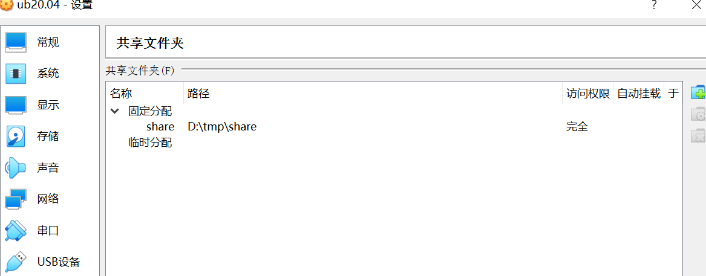
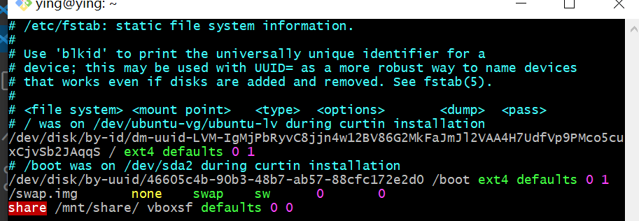

# 实验内容：

### 1.根据[Systemd 入门教程：命令篇](http://www.ruanyifeng.com/blog/2016/03/systemd-tutorial-commands.html)完成基本操作

### 2.根据[Systemd 入门教程：实战篇](http://www.ruanyifeng.com/blog/2016/03/systemd-tutorial-part-two.html)完成相关操作

### 3.自查清单

--------

# 具体内容:

## 一.[根据Systemd 入门教程：命令篇](http://www.ruanyifeng.com/blog/2016/03/systemd-tutorial-commands.html)完成基本操作

### 1.Systemd 概述

`$ systemctl --version`

[](https://asciinema.org/a/485704)

### 2.系统管理

```
# 1.systemd-analyze
# 查看启动耗时
$ systemd-analyze                                                                                       
# 查看每个服务的启动耗时
$ systemd-analyze blame
# 显示瀑布状的启动过程流
$ systemd-analyze critical-chain
# 显示指定服务的启动流
$ systemd-analyze critical-chain atd.service

# 2.hostnamectl
# 显示当前主机的信息
$ hostnamectl

# 设置主机名。
$ sudo hostnamectl set-hostname rhel7

# 3.localectl
# 查看本地化设置
$ localectl

# 设置本地化参数。
$ sudo localectl set-locale LANG=en_GB.utf8
$ sudo localectl set-keymap en_GB

# 4.timedatectl
# 查看当前时区设置
$ timedatectl

# 显示所有可用的时区
$ timedatectl list-timezones  

# 5.loginctl
# 列出当前session
$ loginctl list-sessions

# 列出当前登录用户
$ loginctl list-users

# 列出显示指定用户的信息
$ loginctl show-user cuc
```

[](https://asciinema.org/a/485708)

+ 补充：

```
设置当前时区
$ sudo timedatectl set-timezone America/New_York
$ sudo timedatectl set-time YYYY-MM-DD
$ sudo timedatectl set-time HH:MM:SS
```

[](https://asciinema.org/a/485756)

### 3.Unit

```
# 1.unit的含义
# 列出正在运行的 Unit
$ systemctl list-units

# 列出所有Unit，包括没有找到配置文件的或者启动失败的
$ systemctl list-units --all

# 列出所有没有运行的 Unit
$ systemctl list-units --all --state=inactive

# 列出所有加载失败的 Unit
$ systemctl list-units --failed

# 列出所有正在运行的、类型为 service 的 Unit
$ systemctl list-units --type=service

# 2.unit的状态
# 显示系统状态
$ systemctl status

# 显示单个 Unit 的状态
$ sysystemctl status bluetooth.service

# 显示远程主机的某个 Unit 的状态
$ systemctl -H root@rhel7.example.com status httpd.service

# 3.unit的管理
# 立即启动一个服务
$ sudo systemctl start apache.service

# 立即停止一个服务
$ sudo systemctl stop apache.service

# 重启一个服务
$ sudo systemctl restart apache.service

# 杀死一个服务的所有子进程
$ sudo systemctl kill apache.service

# 重新加载一个服务的配置文件
$ sudo systemctl reload apache.service

# 重载所有修改过的配置文件
$ sudo systemctl daemon-reload

# 显示某个 Unit 的所有底层参数
$ systemctl show httpd.service

# 显示某个 Unit 的指定属性的值
$ systemctl show -p CPUShares httpd.service

# 设置某个 Unit 的指定属性
$ sudo systemctl set-property httpd.service CPUShares=500

# 4.依赖关系
# 列出一个 Unit 的所有依赖
$ systemctl list-dependencies nginx.service

# 列出一个 Unit 的所有依赖，包括 Target 类型
$ systemctl list-dependencies nginx.service
```

[](https://asciinema.org/a/485714)

### 4.Unit 的配置文件

```
# 1.概述
# 在两个目录之间，建立符号链接关系
$ sudo systemctl enable clamd@scan.service
# 等同于
$ sudo ln -s '/usr/lib/systemd/system/clamd@scan.service' '/etc/systemd/system/multi-user.target.wants/clamd@scan.service'

# 在两个目录之间，撤销符号链接关系，相当于撤销开机启动。
$ sudo systemctl disable clamd@scan.service

# 2.配置文件的状态
# 列出所有配置文件
$ systemctl list-unit-files

# 列出指定类型的配置文件
$ systemctl list-unit-files --type=service

# 查看配置文件状态
$ systemctl status bluetooth.service

# 重新加载配置文件，然后重新启动，使修改生效。
$ sudo systemctl daemon-reload
$ sudo systemctl restart httpd.service

# 3.配置文件的格式
#查看配置文件的内容
$ systemctl cat atd.service
```

[](https://asciinema.org/a/485720)

### 5.Target

```
# 查看当前系统的所有 Target
$ systemctl list-unit-files --type=target

# 查看一个 Target 包含的所有 Unit
$ systemctl list-dependencies multi-user.target

# 查看启动时的默认 Target
$ systemctl get-default

# 设置启动时的默认 Target
$ sudo systemctl set-default multi-user.target

# 切换 Target 时，默认不关闭前一个 Target 启动的进程，
# systemctl isolate 命令改变这种行为，

# 关闭前一个 Target 里面所有不属于后一个 Target 的进程
$ sudo systemctl isolate multi-user.target
```

[](https://asciinema.org/a/485724)

### 6.日志管理

```
# 查看所有日志（默认情况下 ，只保存本次启动的日志）
$ sudo journalctl

# 查看内核日志（不显示应用日志）
$ sudo journalctl -k

# 查看系统本次启动的日志
$ sudo journalctl -b
$ sudo journalctl -b -0

# 查看上一次启动的日志（需更改设置）
$ sudo journalctl -b -1

# 查看指定时间的日志
$ sudo journalctl --since="2012-10-30 18:17:16"
$ sudo journalctl --since "20 min ago"
$ sudo journalctl --since yesterday
$ sudo journalctl --since "2015-01-10" --until "2015-01-11 03:00"
$ sudo journalctl --since 09:00 --until "1 hour ago"

# 显示尾部的最新10行日志
$ sudo journalctl -n

# 显示尾部指定行数的日志
$ sudo journalctl -n 20

# 实时滚动显示最新日志
$ sudo journalctl -f

# 查看指定服务的日志
$ sudo journalctl /usr/lib/systemd/systemd

# 查看指定进程的日志
$ sudo journalctl _PID=1

# 查看某个路径的脚本的日志
$ sudo journalctl /usr/bin/bash

# 查看指定用户的日志
$ sudo journalctl _UID=33 --since today

# 查看某个 Unit 的日志
$ sudo journalctl -u nginx.service
$ sudo journalctl -u nginx.service --since today

# 实时滚动显示某个 Unit 的最新日志
$ sudo journalctl -u nginx.service -f

# 合并显示多个 Unit 的日志
$ journalctl -u nginx.service -u php-fpm.service --since today

# 查看指定优先级（及其以上级别）的日志，共有8级
# 0: emerg
# 1: alert
# 2: crit
# 3: err
# 4: warning
# 5: notice
# 6: info
# 7: debug
$ sudo journalctl -p err -b

# 日志默认分页输出，--no-pager 改为正常的标准输出
$ sudo journalctl --no-pager

# 以 JSON 格式（单行）输出
$ sudo journalctl -b -u nginx.service -o json

# 以 JSON 格式（多行）输出，可读性更好
$ sudo journalctl -b -u nginx.serviceqq
 -o json-pretty

# 显示日志占据的硬盘空间
$ sudo journalctl --disk-usage

# 指定日志文件占据的最大空间
$ sudo journalctl --vacuum-size=1G

# 指定日志文件保存多久
$ sudo journalctl --vacuum-time=1years
```

[](https://asciinema.org/a/485726)

-------

## 二.根据[Systemd 入门教程：实战篇](http://www.ruanyifeng.com/blog/2016/03/systemd-tutorial-part-two.html)完成相关操作

[](https://asciinema.org/a/485729)

-------

## 三.自查清单

### 1.如何添加一个用户并使其具备sudo执行程序的权限？

```
sudo adduser newuser
sudo adduser newuser sudo
```

[](https://asciinema.org/a/485732)

### 2.如何将一个用户添加到一个用户组？

```
sudo usermod -a -G <groupname> <username>
```

[](https://asciinema.org/a/485749)

### 3.如何查看当前系统的分区表和文件系统详细信息？

[](https://asciinema.org/a/485752)

### 4.如何实现开机自动挂载Virtualbox的共享目录分区？

+ 在windows的目录下建立共享文件夹，然后，在virtualbox的共享文件夹里面设置好:



+ 然后在虚拟机的/mnt路径下新建一个share文件夹并挂载

```
$ sudo mkdir /mnt/share
$ sudo mount -t vboxsf share /mnt/share/
```

+ 最后修改fstab文件，在文件末添加：`sharefile /mnt/share/ vboxsf defaults 0 0`



### 5.基于LVM（逻辑分卷管理）的分区如何实现动态扩容和缩减容量？

```
lvextend -L +{扩容大小} {挂载目录}
lvreduce -L -{缩容大小} {挂载目录}
```

### 6.如何通过systemd设置实现在网络连通时运行一个指定脚本，在网络断开时运行另一个脚本？

[](https://asciinema.org/a/LMR79A9gPJTXkRX0zcHwBVpF0)

### 7.如何通过systemd设置实现一个脚本在任何情况下被杀死之后会立即重新启动？

打开对应脚本的设置文件，在[unit]区块中添加`StartLimitIntervalSec=0`，在[Service]中添加以下代码：

```
Restart=always
RestartSec=1
```

-------

# 参考资料

[创建有sudu权限的新用户](https://blog.csdn.net/yzf279533105/article/details/122732221)

[Ubuntu添加用户和用户组](https://mbd.baidu.com/ma/s/9LiYc146)

[Virtualbox实现共享文件夹并自动挂载](https://blog.csdn.net/hexf9632/article/details/93774198)

[ubantu systemd用法](https://blog.csdn.net/zong596568821xp/article/details/102739649)
