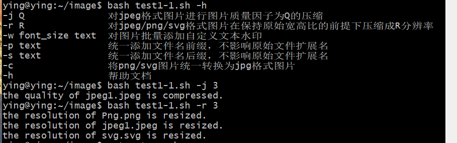
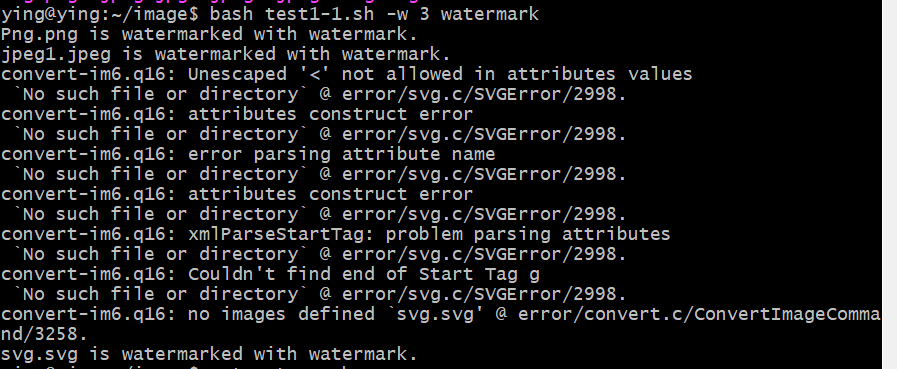
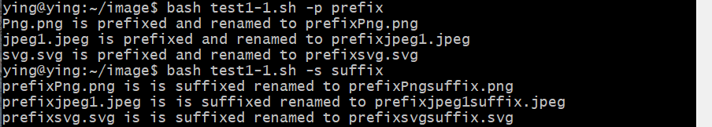
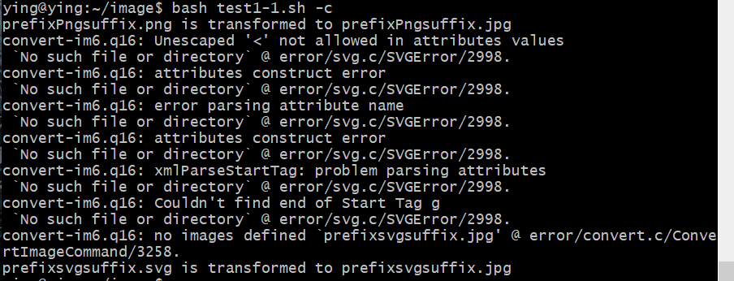
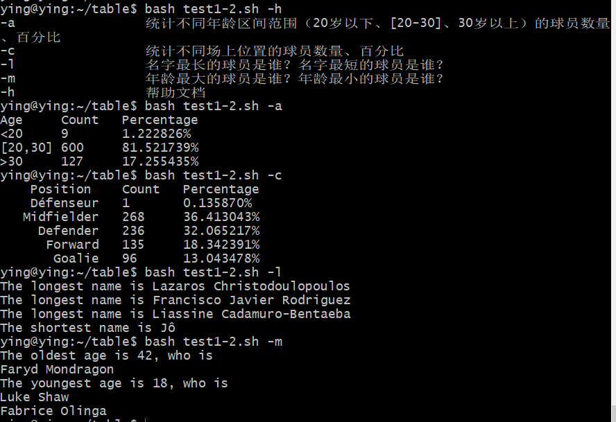
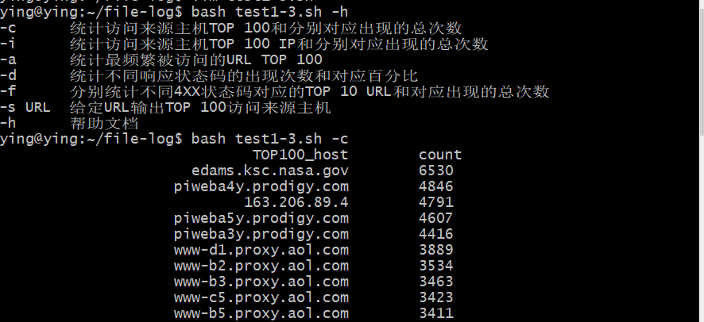
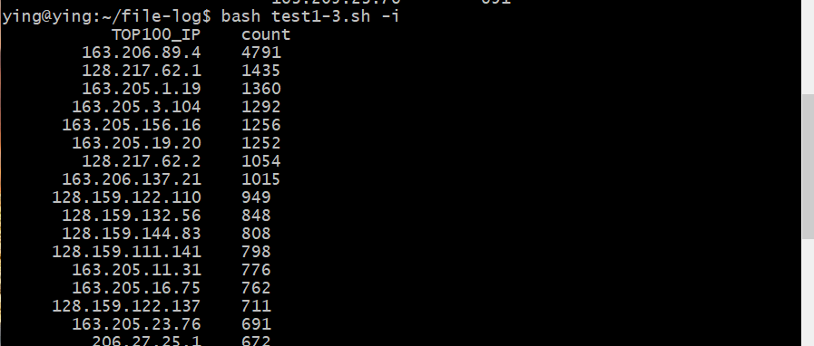
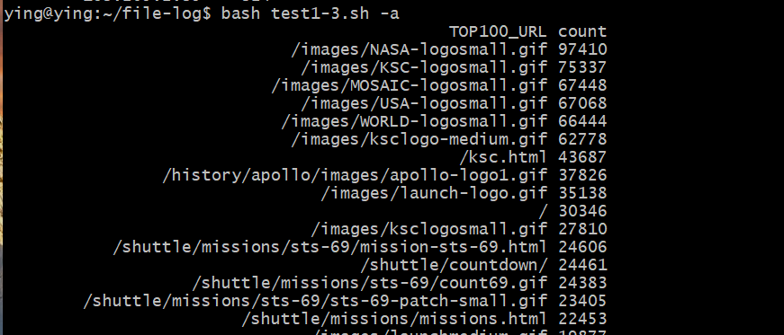
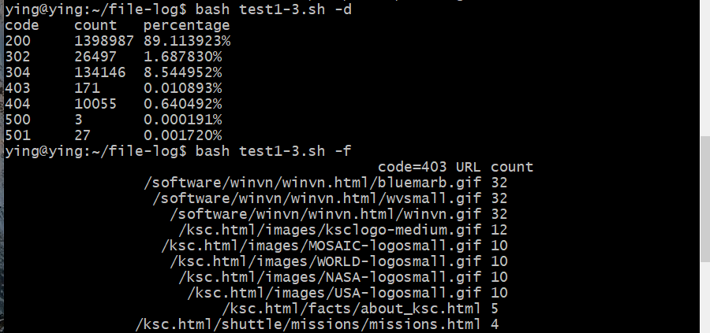
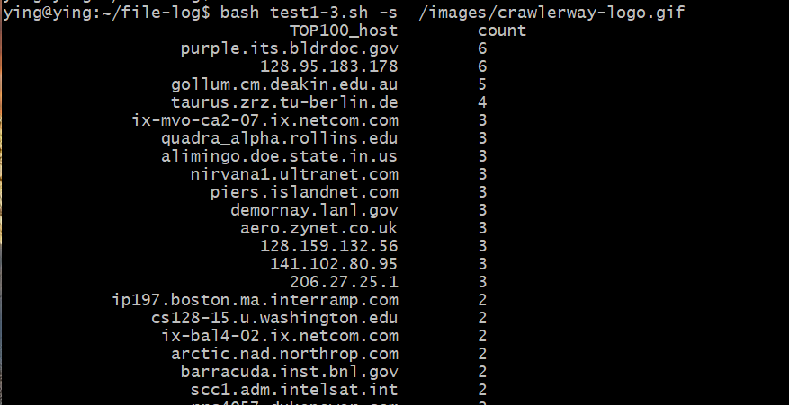

# 实验要求

### 一、用bash编写一个图片批处理脚本，实现以下功能：

* ☑️支持命令行参数方式使用不同功能

* ☑️支持对指定目录下所有支持格式的图片文件进行批处理指定目录进行批处理

* ☑️支持以下常见图片批处理功能的单独使用或组合使用

    * ☑️支持对jpeg格式图片进行图片质量压缩

    * ☑️支持对jpeg/png/svg格式图片在保持原始宽高比的前提下压缩分辨率

    * ☑️支持对图片批量添加自定义文本水印

    * ☑️支持批量重命名（统一添加文件名前缀或后缀，不影响原始文件扩展名）
    
    * ☑️支持将png/svg图片统一转换为jpg格式

### 二、用bash编写一个文本批处理脚本，对以下附件分别进行批量处理完成相应的数据统计任务：
* ☑️统计不同年龄区间范围（20岁以下、[20-30]、30岁以上）的球员数量、百分比

* ☑️统计不同场上位置的球员数量、百分比

* ☑️名字最长的球员是谁？名字最短的球员是谁？

* ☑️年龄最大的球员是谁？年龄最小的球员是谁？

### 三、用bash编写一个文本批处理脚本，对以下附件分别进行批量处理完成相应的数据统计任务：
* ☑️统计访问来源主机TOP 100和分别对应出现的总次数

* ☑️统计访问来源主机TOP 100 IP和分别对应出现的总次数

* ☑️统计最频繁被访问的URL TOP 100

* ☑️统计不同响应状态码的出现次数和对应百分比

* ☑️分别统计不同4XX状态码对应的TOP 10 URL和对应出现的总次数

* ☑️给定URL输出TOP 100访问来源主机

### 四、所有源代码文件必须单独提交并提供详细的-help脚本内置帮助信息，任务三的所有统计数据结果要求写入独立实验报告

---

# 实验内容

#### 一、实验一

- 安装`imagemagick`和`shellcheck`，并用`scp`上传满足格式的图片文件

```
sudo apt update && apt-get install shellcheck
sudo apt-get install imagemagick
scp C:/Users/ying/Desktop/{目标文件} ying@192.168.56.101:~/image
```

- 在对应目录下编写bash脚本，脚本内容放在`/ScriptCode/test1-1.sh`中

- 运行bash脚本后的结果如下所示

  - ​	帮助手册和对JPEG格式图片进行质量压缩，以及对jpeg/png/svg图片压缩分辨率 

    

  - 对图片添加自定义文本水印

    

  - 对图片文件添加前缀或后缀

    

  - 将png/svg图片统一转换成jpg图片

    

------

#### 二、实验二

- 先下载tsv文件

```
wget "https://c4pr1c3.gitee.io/linuxsysadmin/exp/chap0x04/worldcupplayerinfo.tsv"
```

- 在对应目录下编写bash脚本，脚本内容放在`/ScriptCode/test1-2.sh`中

- bash脚本运行结果如下所示

  - ​	帮助手册和各参数结果

    

------

#### 三、实验三

- 下载文件到本地并解压缩

```
wget "https://c4pr1c3.github.io/LinuxSysAdmin/exp/chap0x04/web_log.tsv.7z"
```

```
7z x web_log.tsv.7z
```

- 在对应目录下编写bash脚本，脚本内容放在`/ScriptCode/test1-3.sh`中

- 脚本运行后的结果如下所示

  - ​	帮助手册和来源主机TOP100和分别对应出现的次数

    

  - 来源主机TOP 100 IP和分别对应出现的次数

    

  - 最频繁被访问的URL TOP 100

    

  - 不同响应状态码的出现次数和对应百分比和不同4XX状态码对应的TOP 10 URL和对应出现的总次数

    

  - 给定URL输出TOP 100访问来源主机

    

#### 构建Travis

Travis链接：[Travis CI]([CUCCS/2022-linux-public-yingxue-cloud - Travis CI (travis-ci.com)](https://app.travis-ci.com/github/CUCCS/2022-linux-public-yingxue-cloud/branches))

------

## 实验遇到的问题

------

- 在进行第一个实验，最开始没有把bash脚本放到对应目录下，因此运行时一直在报错，后来经过检查，发现bash脚本应该放到图片对所在目录下，这里用命令`cp`完成了文件的复制转移

- 不知道怎么配置Travis CI。代码编写不是问题，重要的是Travis的配置和运行。需要注意的是Travis要求开源项目的根目录下必须要有`.travis.yml`文件。这是Travis的配置文件，必须保存在GitHub仓库中。Travis会执行GitHub中保存的脚本里的命令。


------

[scp命令](https://www.coonote.com/linux/linux-cmd-scp.html)

[把文件复制到对应目录下](https://blog.csdn.net/zouyang920/article/details/122685931)

[持续集成服务 Travis CI 教程 - 阮一峰的网络日志 ](https://www.ruanyifeng.com/blog/2017/12/travis_ci_tutorial.html)

[markdown官方教程](https://markdown.com.cn/tools.html)

