# 实验五：Web服务器（实验）

## 实验环境

- Ubuntu 20.04 Server
- 软件环境
  - ubantu20.04虚拟机
  - Windows 10
  - Nginx
  - VeryNginx
  - WordCompress 4.7
  - Damn Vulnerable Web Application (DVWA)

------

## 实验内容

### 1、基本要求

- 在一台主机（虚拟机）上同时配置Nginx和VeryNginx
- VeryNginx作为本次实验的Web App的反向代理服务器和WAF
- PHP-FPM进程的反向代理配置在nginx服务器上，VeryNginx服务器不直接配置Web站点服务
- 使用Wordpress搭建的站点对外提供访问的地址为： [http://wp.sec.cuc.edu.cn](http://wp.sec.cuc.edu.cn/)
- 使用Damn Vulnerable Web Application (DVWA)搭建的站点对外提供访问的地址为： [http://dvwa.sec.cuc.edu.cn](http://dvwa.sec.cuc.edu.cn/)

### 2、安全加固要求

- 使用IP地址方式均无法访问上述任意站点，并向访客展示自定义的友好错误提示信息页面-1
- Damn Vulnerable Web Application (DVWA)只允许白名单上的访客来源IP，其他来源的IP访问均向访客展示自定义的友好错误提示信息页面-2
- 在不升级Wordpress版本的情况下，通过定制VeryNginx的访问控制策略规则，热修复WordPress < 4.7.1 - Username Enumeration
- 通过配置VeryNginx的Filter规则实现对Damn Vulnerable Web Application (DVWA)的SQL注入实验在低安全等级条件下进行防护

### 2、VeryNginx配置要求

- VeryNginx的Web管理页面仅允许白名单上的访客来源IP，其他来源的IP访问均向访客展示自定义的友好错误提示信息页面-3
- 通过定制VeryNginx的访问控制策略规则实现：
  - 限制DVWA站点的单IP访问速率为每秒请求数 < 50
  - 限制Wordpress站点的单IP访问速率为每秒请求数 < 20
  - 超过访问频率限制的请求直接返回自定义错误提示信息页面-4
  - 禁止curl访问

------

## 实验过程

<dr>

### 一、环境搭建

<dr>

#### 更改Windows的hosts文件

```
# nginx
192.168.56.102 vn.sec.cuc.edu.cn
192.168.56.102 dvwa.sec.cuc.edu.cn
192.168.56.102 wp.sec.cuc.edu.cn
```

1. 下载nginx

- 安装

```
 sudo apt install nginx
```

- 打开配置文件

```
# sudo vim /etc/nginx/sites-enabled/default
```

- 修改配置文件

```shell
root /var/www/html/wp.sec.cuc.edu.cn;

  # Add index.php to the list if you are using PHP
  index readme.html index.php;

location ~ \.php$ {
	#	include snippets/fastcgi-php.conf;
	#
	#	# With php-fpm (or other unix sockets):
		fastcgi_pass unix:/var/run/php/php7.4-fpm.sock;
		fastcgi_index index.php;
		fastcgi_param SCRIPT_FILENAME $document_root$fastcgi_script_name;
		include fastcgi_params;
	#	# With php-cgi (or other tcp sockets):
#		fastcgi_pass 127.0.0.1:9000;
	}
```

2. 下载VeryNginx

+ 安装之前对缺失的库补充安装

```
# zlib
sudo apt-get install zlib1g-dev

# pcre
sudo apt-get install libpcre3-dev

# gcc (已有)
sudo apt install gcc

# make
sudo apt install make

# penssl library
sudo apt-get update
sudo apt install libssl-dev
```

+ 克隆VeryNginx仓库

```
git clone https://github.com/alexazhou/VeryNginx.git

cd VeryNginx

# python3
sudo python3 install.py install
```

- 配置

```
# 修改配置文件`/opt/verynginx/openresty/nginx/conf/nginx.conf`
sudo vim /opt/verynginx/openresty/nginx/conf/nginx.conf

#修改设置

# 用户名
user  www-data;

# 监听端口
# 为了不和其他端口冲突，此处设置为8081
server {
        listen 192.168.56.101:8081;
        
        #this line shoud be include in every server block
        include /opt/verynginx/verynginx/nginx_conf/in_server_block.conf;

        location = / {
            root   html;
            index  index.html index.htm;
        }
    }
```

- 添加进程权限

```
chmod -R 777 /opt/verynginx/verynginx/configs
```

- 在浏览器访问服务器的8081端口，成功安装verynginx

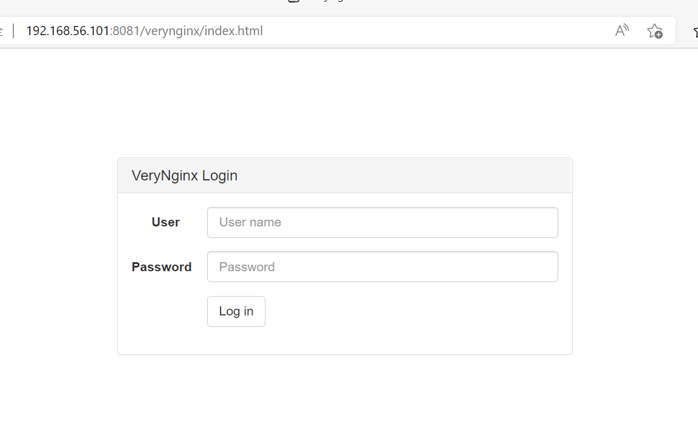

- 用户名和密码都是verynginx，登录进去后界面如下

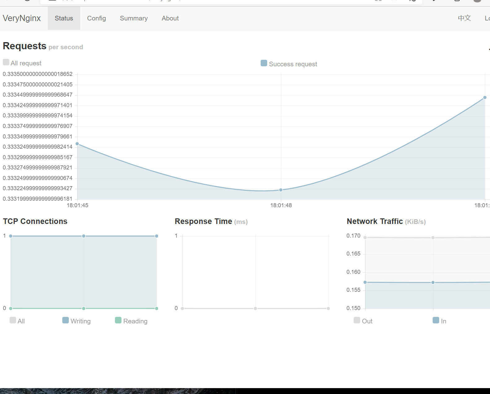

### 3.WordPress

- 安装与配置

```
# 下载安装包
sudo wget https://wordpress.org/wordpress-4.7.zip

# 解压
7z x wordpress-4.7.zip

# 将解压后的wordpress移至指定路径
sudo mkdir /var/www/html/wp.sec.cuc.edu.cn
sudo cp -r wordpress /var/www/html/wp.sec.cuc.edu.cn
```

- 补充数据库信息

```
# 安装MySQL
apt-get install mysql-server

# 进入MySQL
sudo mysql

# 建库
CREATE DATABASE wordpress DEFAULT CHARACTER SET utf8 COLLATE utf8_unicode_ci;

# 新建用户
create user 'ying'@'localhost' identified by '**********';

# 授权
grant all on wordpress.* to 'ying'@'localhost';
```

- 配置

```
# 修改wp-config-sample中的内容，再将其更名为wp-config
sudo vim wp-config-sample
mv wp-config-sample wp-config
```
 
- 具体配置内容如下

```shell
// ** MySQL settings - You can get this info from your web host ** //
/** The name of the database for WordPress */
define('DB_NAME', 'wordpress');

/** MySQL database username */
define('DB_USER', 'username');

/** MySQL database password */
define('DB_PASSWORD', 'password');

/** MySQL hostname */
define('DB_HOST', 'localhost');

/** Database Charset to use in creating database tables. */
define('DB_CHARSET', 'utf8');

/** The Database Collate type. Don't change this if in doubt. */
define('DB_COLLATE', '');
```

- 更改文件的所有权

```
sudo chown -R www-data:www-data /var/www/html
```

- 在浏览器中打开wordpress

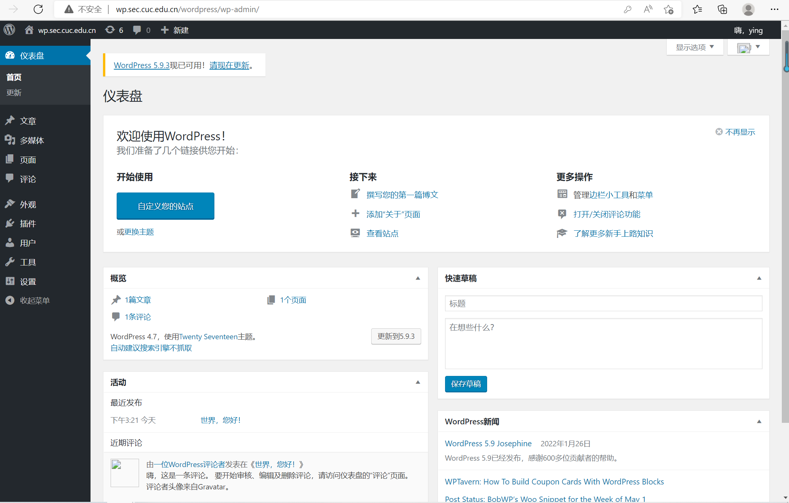

### 4.DVWA

- 安装

```shell
# 下载
git clone https://github.com/digininja/DVWA.git
# 建立目录
sudo mkdir /var/www/html/dvwa.sec.cuc.edu.cn
# 移动文件夹内容至对应目录下
sudo mv DVWA/* /var/www/html/dvwa.sec.cuc.edu.cn
```

- 补充MySQL

```
# 进入MySQL
sudo mysql
# 创建数据库
CREATE DATABASE dvwa DEFAULT CHARACTER SET utf8 COLLATE utf8_unicode_ci;
# 创建用户
CREATE USER 'dvwa'@'localhost' IDENTIFIED BY 'p@ssw0rd';
# 授权
GRANT ALL ON dvwa.* TO 'dvwa'@'localhost';
# 退出MySQL
exit
```

- 配置PHP

```
# 下载PHP及相关组件
sudo apt install php-fpm php-mysql php-curl php-gd php-intl php-mbstring php-soap php-xml php-xmlrpc php-zip
```

```
sudo mv config.inc.php.dist config.inc.php

# 默认配置：
$_DVWA[ 'db_database' ] = 'dvwa';
$_DVWA[ 'db_user' ] = 'dvwa';
$_DVWA[ 'db_password' ] = 'p@ssw0rd';

# 修改php-fpm文件
sudo vim /etc/php/7.4/fpm/php.ini 
display_errors: Off
safe_mode: Off
allow_url_include: On
allow_url_fopen: On

#重启php
systemctl restart php7.4-fpm.service
```

- 授权给www-data用户和组
```
sudo chown -R www-data.www-data /var/www/html/dvwa.sec.cuc.edu.cn
```

- 配置服务器块文件
```shell
sudo vim /etc/nginx/sites-available/dvwa.sec.cuc.edu.cn

# 写入配置文件
server {
    listen 8080 default_server;
    listen [::]:8080 default_server;
    root /var/www/html/dvwa.sec.cuc.edu.cn;
    index index.php index.html index.htm index.nginx-debian.html;
    server_name dvwa.sec.cuc.edu.cn;
    location / {
        #try_files $uri $uri/ =404;
        try_files $uri $uri/ /index.php$is_args$args;  
    }
    location ~ \.php$ {
        include snippets/fastcgi-php.conf;
        fastcgi_pass unix:/var/run/php/php7.4-fpm.sock;
    }
    location ~ /\.ht {
        deny all;
    }
}
```

- 创建软链接
```
sudo ln -s /etc/nginx/sites-available/dvwa.sec.cuc.edu.cn /etc/nginx/sites-enabled/
```

- 检查并重启服务
```
sudo nginx -t
systemctl restart nginx.service
```

- 在浏览器成功访问DVWA

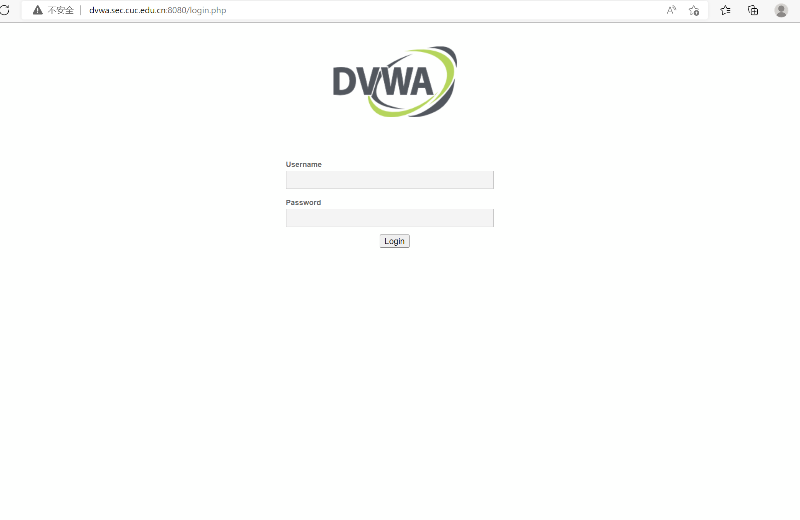


-------
## 实验内容

### 1、使用VeryNginx反向代理Wordpress，DVWA

- 在VeryNginx的浏览器界面进行配置

 - Matcher

 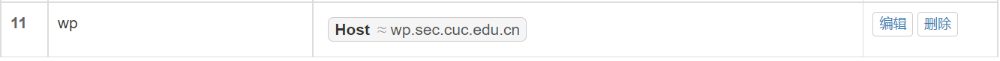
 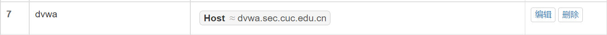

- Up Stream


- Proxy Pass


### 2、安全加固要求

（1）、使用IP地址方式均无法访问上述任意站点，并向访客展示自定义的友好错误提示信息页面-1

- Matcher

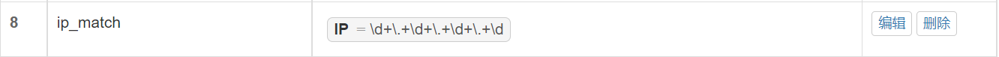

- Response


- Filter

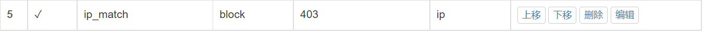

- 实现结果如下

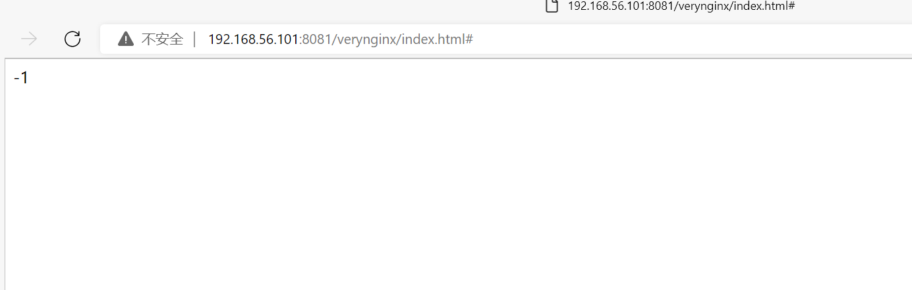

（2）、 Damn Vulnerable Web Application (DVWA)只允许白名单上的访客来源IP，其他来源的IP访问均向访客展示自定义的友好错误提示信息页面-2

- Matcher

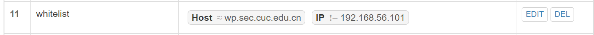

- Response

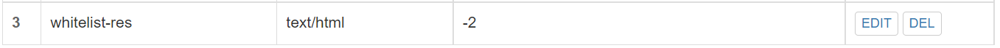

- Filter

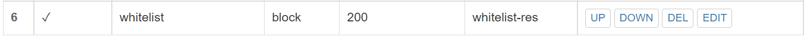

- 实现结果如下

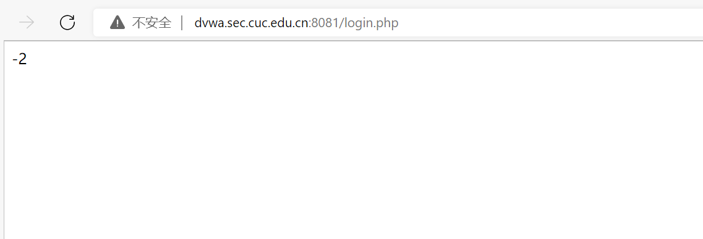

（3）、 通过配置VeryNginx的Filter规则实现对Damn Vulnerable Web Application (DVWA)的SQL注入实验在低安全等级条件下进行防护

- 首先再dvwa里修改安全等级到low，在DVWA Security里

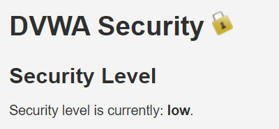

- Matcher

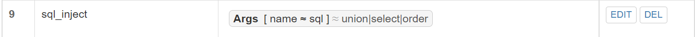

- Filter

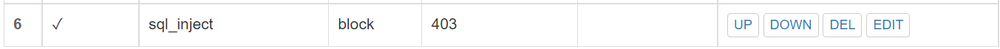

### 3、VeryNginx配置要求

（1）VeryNginx的Web管理页面仅允许白名单上的访客来源IP，其他来源的IP访问均向访客展示自定义的友好错误提示信息页面-3

- Matcher

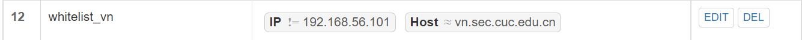

- Response

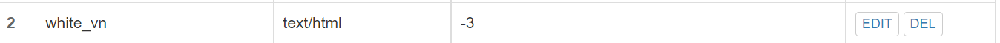

- filter

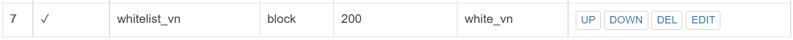

- 实现结果如下

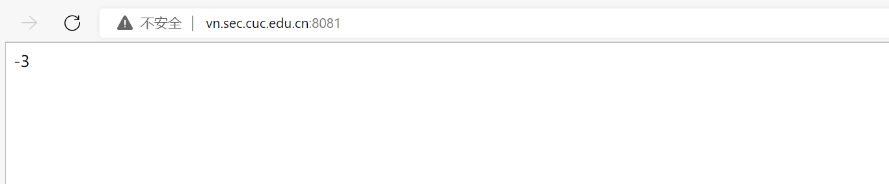

(2)通过定制VeryNginx的访问控制策略规则实现：
  - 限制DVWA站点的单IP访问速率为每秒请求数 < 50
  - 限制Wordpress站点的单IP访问速率为每秒请求数 < 20
  - 超过访问频率限制的请求直接返回自定义错误提示信息页面-4

    - Frequency Limit

    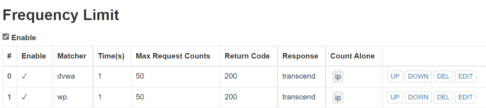

    - Response

    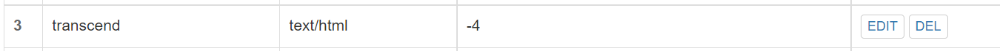

    - 用ab压力测试工具分别测试dvwa和wordpress

    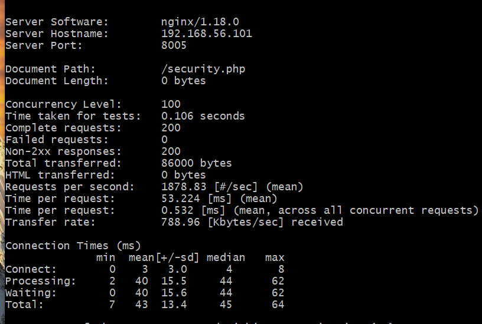

    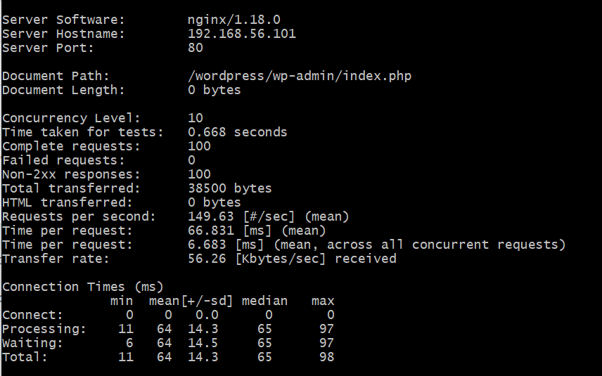
- 禁止curl访问

  - Matcher

  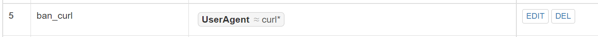

  - Response 

  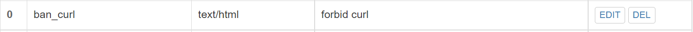

   - Filter

  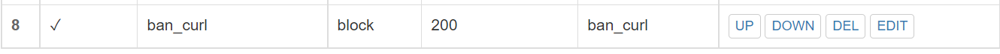

  - 实现结果如下

  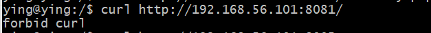

-------

# 实验问题

- 在整个实验流程中非常常见的问题就是网站界面打不开的问题，往往是配置出了一点小问题，通常修改的是配置文件的端口，要确保网站不会冲突，而过程中wordpress实在是找不到问题出在那里，因此我选择重新安装wordpress来解决问题

- 还有一次比较严重的问题是在配置安全加固要求——使用IP地址方式均无法访问上述任意站点，并向访客展示自定义的友好错误提示信息页面-1时，没有提前对虚拟机进行备份，导致verynginx打不开，显示-1。后来，我通过查看verynginx的官方文档，找到了解决方法，避免了从头再来的悲剧。

  具体的解决方法我在畅课讨论区中列了出来，就是这篇[【踩坑】关于设置“使用IP无法访问，并返回自定义错误信息”，结果把verynginx搞成无法访问的血泪教训`](http://courses.cuc.edu.cn/course/82669/forum#/topics/290623?show_sidebar=false&scrollTo=topic-290623&pageIndex=1&pageCount=2&topicIds=294910,294841,294502,293821,290623,290083,289714,285751,285211,284851&predicate=lastUpdatedDate&reverse)

--------

# 参考链接

[wordpress下载](https://zhuanlan.zhihu.com/p/445191504)

[verynginx官方gitee文档](https://gitee.com/alexa/VeryNginx)

[修改apache的监听端口](https://blog.csdn.net/worldmakewayfordream/article/details/77878835#:~:text=%3A%20make_sock%3A%20could%20not%20bind,to%20address%200.0.0.0%3A80%E2%80%9D%E7%9A%84%E9%94%99%E8%AF%AF%E3%80%82%20%E4%BB%8E%E7%BD%91%E4%B8%8A%E6%9F%A5%E6%98%AF%E6%98%AF%E7%AB%AF%E5%8F%A3%E5%86%B2%E7%AA%81%EF%BC%8C%E4%BB%94%E7%BB%86%E6%A3%80%E6%9F%A5%E5%8F%91%E7%8E%B080%E7%AB%AF%E5%8F%A3%E8%A2%ABIIS%E5%8D%A0%E7%94%A8%E4%BA%86%E3%80%82%20%E8%A7%A3%E5%86%B3%E6%96%B9%E6%B3%95%EF%BC%9A%E6%94%B9%E7%AB%AF%E5%8F%A3%E5%8F%B7%EF%BC%8C%E6%89%93%E5%BC%80.apacheconfhttpd.conf%EF%BC%8C%E5%B0%86%E5%85%B6%E4%B8%AD%E7%9A%84%E7%9B%91%E5%90%AC%E7%AB%AF%E5%8F%A3%EF%BC%8C%E7%94%B180%E6%94%B9%E4%B8%BA81)

[ab压力测试工具的用法](https://www.jianshu.com/p/43d04d8baaf7)
