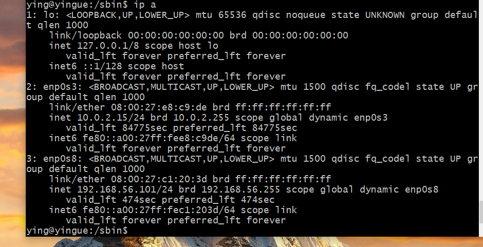
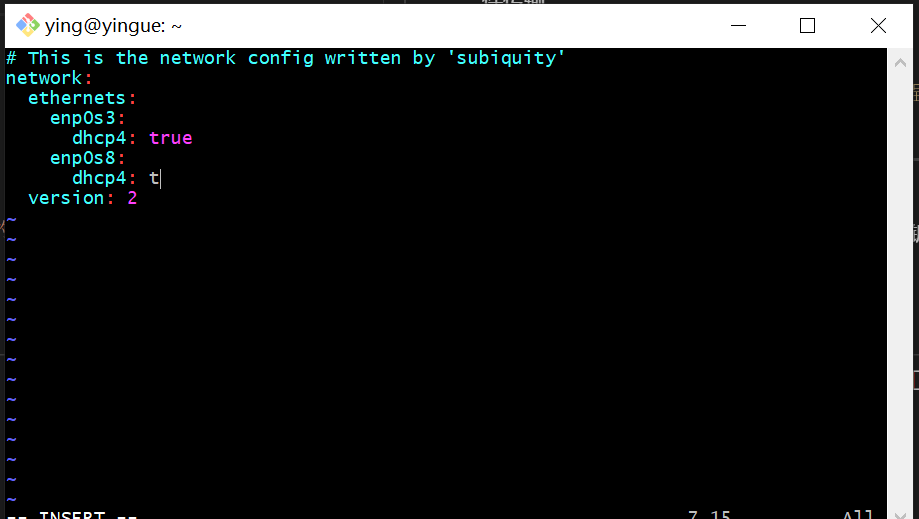
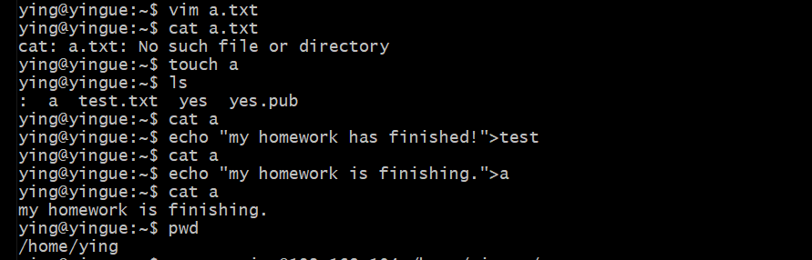
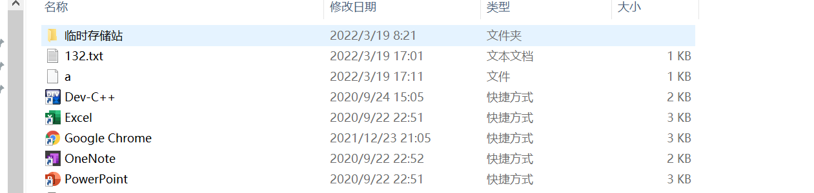
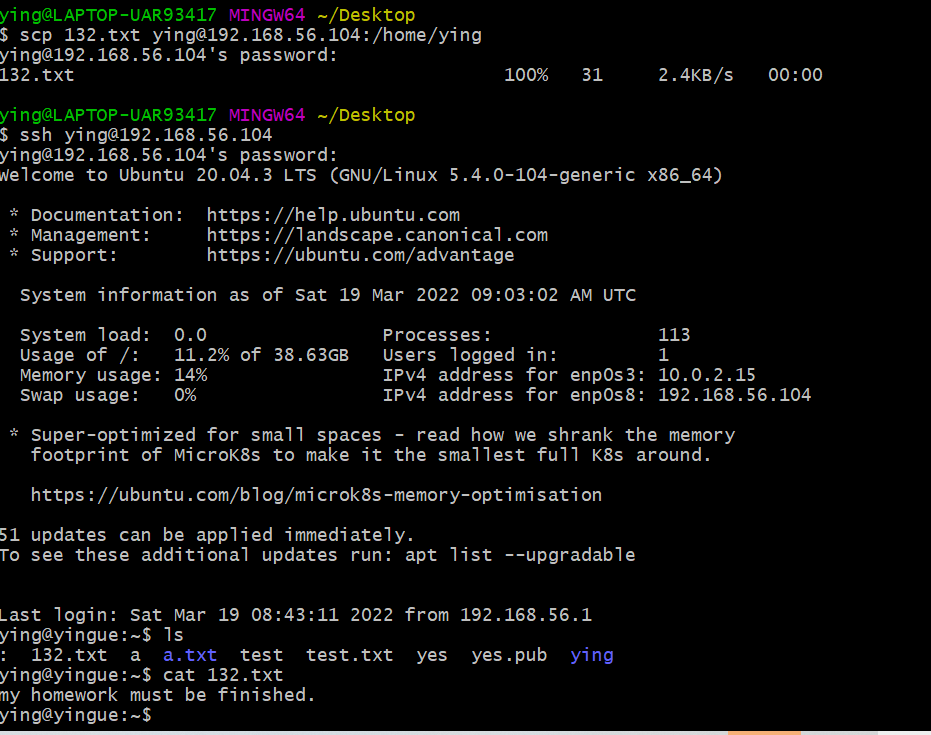
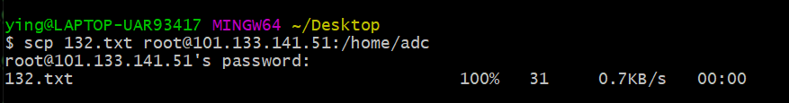
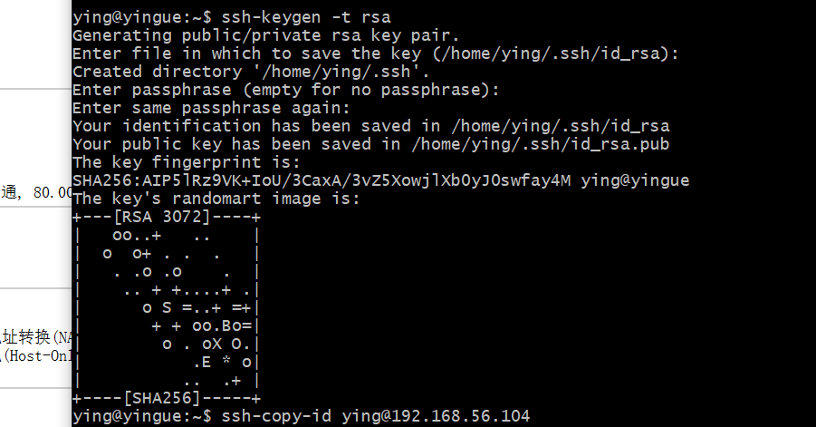
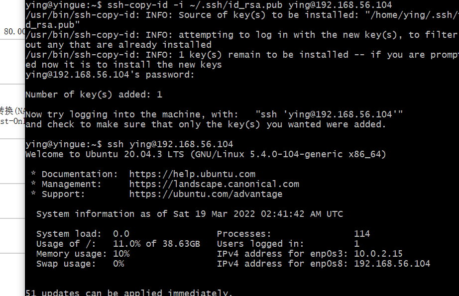
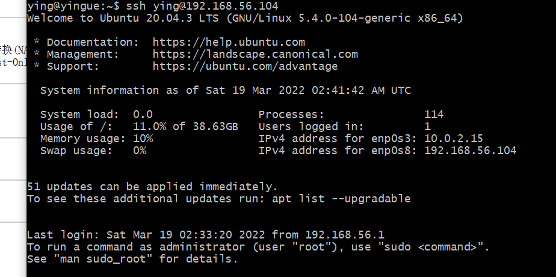

# 实验环境

+ VirtualBox Linux ubantu 20.04

+ git-bash & cmd

+ 阿里云提供的云上实践平台

# 实验问题

+ 调查并记录实验环境的如下信息：

  当前 Linux 发行版基本信息

  当前 Linux 内核版本信息

+ Virtualbox 安装完 Ubuntu 之后新添加的网卡如何实现系统开机自动启用和自动获取 IP？
+ 如何使用 scp 在「虚拟机和宿主机之间」、「本机和远程 Linux 系统之间」传输文件？
+ 如何配置 SSH 免密登录？

# 实验过程

### 调查当前Linux发行版和内核版本基本信息：

```
lsb_release -a
\\查看当前Linux发行版基本信息
```


```
uname -a
\\查看当前Linux内核版本信息
```



---

### Virtualbox 安装完Ubuntu之后新添加的网卡如何实现系统开机自动启用和自动获取IP

首先使用ip a命令来查看网卡的接口信息，如果新的网卡没有显示，则需要对新的网卡进行自启动和自动获取ip配置

通过命令`sudo vim /etc/netplan/00-installer-config.yaml`打开文件yaml



然后，在此文件中对新网卡的dhcp地址进行分配，添加新网卡有关信息。（这里使用的是vim编辑器）

最后，执行`sudo netplan apply`命令使上述操作生效。

---

### 用scp实现本机与虚拟机之间的文件传输

+ 用`scp remote_username@remote_ip:remote_folder`实现从虚拟机到主机的文件传输

  在虚拟机里新建一个文件并输入内容：

  

  随后在主机的命令行里输入： 

  `scp ying@192.168.56.104:/home/ying/a /Users/ying/Desktop`

  最终成功在主机里查看传输的文件

  

+ 用`scp local_file remote_username@remote_ip:remote_folder`实现主机到虚拟机的文件传输，传输的文件132.txt在桌面上。

  `scp 132.txt ying@192.168.56.104:/home/ying`

  最终在虚拟机中找到上可以看到传输的文件

  

### 用scp在本地与远程服务器上传输文件

其用法与主机到虚拟机的用法相同

+ 用`scp 132.txt root@101.133.141.51:/home/adc`命令实现本地到阿里云上的Linux系统的文件传输

   

+ 用`scp root@101.133.141.51:/home/adc/b /Users/ying/Desktop`实现阿里云上的Linux系统到本地的文件传输。


---

### 配置ssh免密登录

+ 首先，使用`ssh-keygen`生成密钥，将公钥文件上传到虚拟机上即可实现免密登录：

`ssh-keygen -t rsa`

如图所示：



+ 然后通过`ssh-copy-id`命令复制本机公钥到虚拟机上：

` ssh-copy-id -i ~/.ssh/id_rsa.pub ying@192.168.56.104`



+ 完成上述操作即可实现ssh免密登录



# 问题及相应解决方案

### 使用scp传输文件

在本地到远程的过程中，阿里云的密码一直输入不正确，导致无法完成传输。最后使用复制粘贴的方式解决。

### ssh免密登录遇到的问题

+ 在配置免密登录之前通过`cd`打开了一个文件，但忘记退出就直接配置免密登录，导致免密配置失败。经过查找资料，发现可以通过重新安装ssh来解决，但因为对Linux还不太熟悉，所以尝试了一下就放弃了，然后选择又重新安装了虚拟机。

+ 另一个问题是在通过`ssh-copy-id`命令复制公钥时，最开始打命令时，省掉了
`-i ~/.ssh/id_rsa.pub`。不过因为前一个问题的存在，这个问题并不太明显，在重新开始后就加上了。

